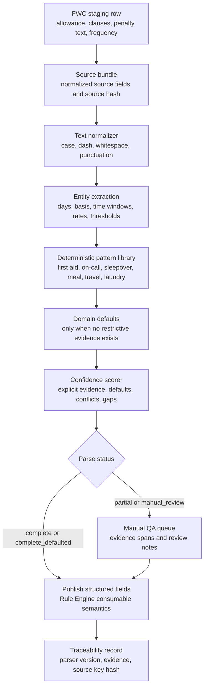
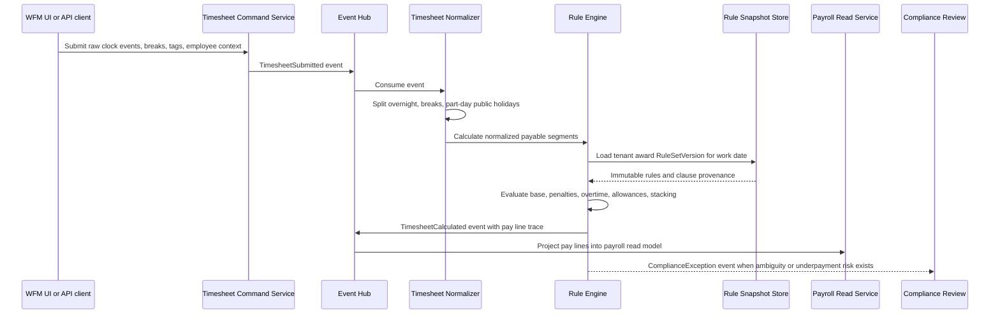
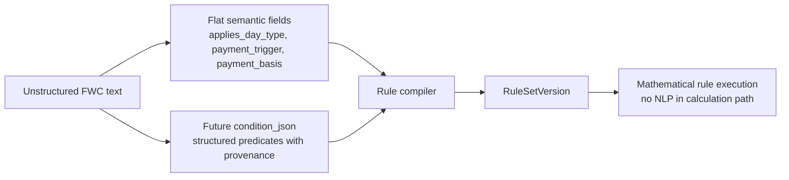

# Architecture Diagrams

This page captures the target platform flows that drive the first interpreter implementation. The diagrams are intentionally executable Markdown so architecture, implementation tasks, automated tests, and Manual QA can stay in one repository.

## End-To-End Platform View

```mermaid
flowchart LR
  FWC["FWC MAPD API"] --> Ingest["FWC ETL ingestion service<br/>Python scheduled worker"]
  Ingest --> Raw["Raw landing tables<br/>tenant neutral source snapshots"]
  Raw --> Stage["Staging tables<br/>allowances, penalties, classifications"]
  Stage --> Interpreter["Clause Interpreter<br/>normalizer, deterministic parser, confidence scorer"]
  Interpreter --> Parsed["Parsed award semantics<br/>flat parse fields plus future condition_json"]
  Interpreter --> Review["Compliance review queue<br/>low confidence and ambiguous clauses"]
  Review --> Parsed
  Parsed --> RuleBuilder["Rule publication service<br/>RuleSetVersion compiler"]
  RuleBuilder --> RuleStore["Immutable rule snapshots<br/>SCD Type 2 effective dating"]

  TenantApi["Tenant APIs<br/>award selection, employee context"] --> RuleEngine["Rule Engine<br/>stateless calculation brain"]
  Clock["Time and attendance events"] --> Timesheet["Timesheet command service<br/>CQRS write model"]
  Timesheet --> Events["Event Hub<br/>timesheet events"]
  Events --> Normalizer["Timesheet normalizer<br/>segments, breaks, public holidays"]
  Normalizer --> RuleEngine
  RuleStore --> RuleEngine
  RuleEngine --> PayEvents["Pay calculation events<br/>pay lines and compliance trace"]
  PayEvents --> ReadModel["Payroll read model<br/>employee, period, tenant aggregates"]
  ReadModel --> STP["STP Phase 2 exporter"]
  ReadModel --> Payroll["Payroll integrations<br/>Xero, MYOB, API consumers"]
```

## Clause Interpreter Pipeline

## Rule Execution And CQRS Flow

## Interpreter To Rule Engine Contract

Key boundary: NLP and interpretation stay in the ETL and compliance review path. The Rule Engine only consumes versioned, reviewed, structured rule conditions.
